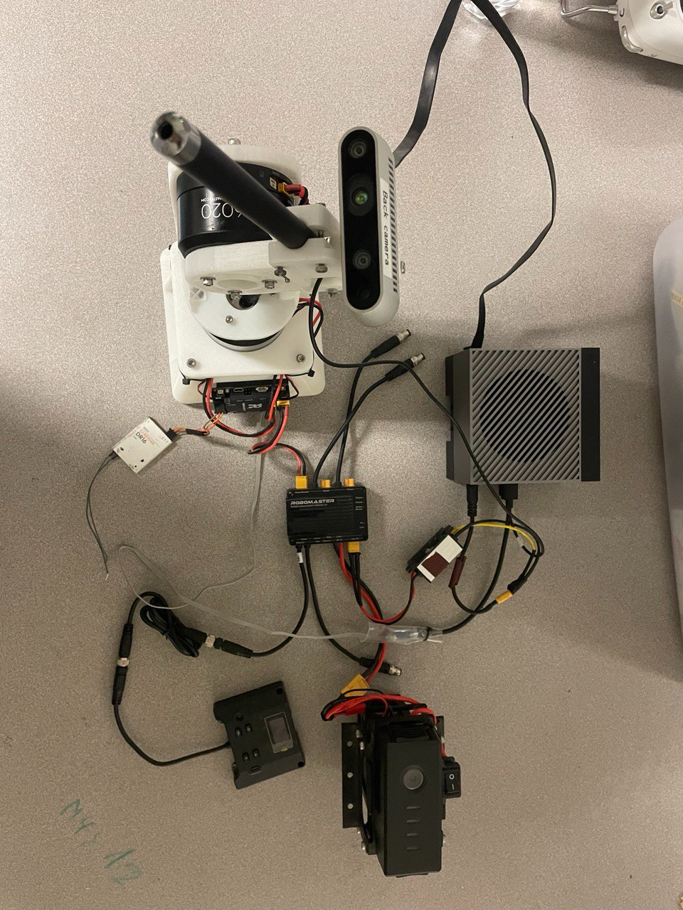
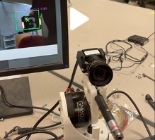
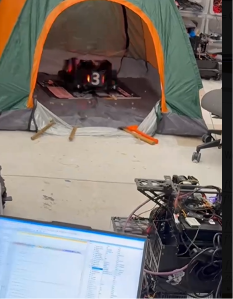

<!--
Generated from actual commit history (CV_RMUC_2026, RMUC_CV_2026_CPP).
"Why" explanations are reconstructed from the code and standard practice —
Barry: verify each one matches your actual reasoning before treating this as final.
-->

# RoboMaster CV journey — 2024 to 2026

How our auto-aim vision pipeline evolved across two seasons and my part in it.

---

## 2024 Sep - 2025 Jan: the Aimbot Trainer and the Python pipeline

I started from zero. To learn the auto-aim problem end-to-end, I asked a
mechanical-engineering friend to build a gimbal test rig with GM6020 motors driven
by an STM32 over CAN, controlled with an RC remote. That rig taught me embedded C,
PID tuning and eventually became the testbed for the vision stack: first
YOLOv8 on a RealSense + laptop, later a Jetson Orin AGX + Hikrobot industrial
camera talking to the STM32 over UART, with Kalman-filter target prediction.

*The trainer in action — live armor-plate detection on screen, driving the gimbal:*

### From bounding boxes to 3D pose

Detection alone isn't aiming — the gimbal needs the target's 3D position. My
entry point was the **PnP solver** (`PnP Solver`, 2025-09-11): armor plates have
a known real-world geometry, so I used a **YOLOv11-pose model that outputs the
4 corner keypoints** of the plate, then `solvePnP` to recover distance and
orientation from those correspondences.

**Why keypoints + PnP instead of monocular depth or stereo:** the plate's
dimensions are fixed and known, so 4 well-localized corners give metric 3D pose
from a single camera with no depth sensor needed, which is also why the RealSense
eventually became unnecessary.

### Industrial camera integration 

I built the **Hikrobot camera integration** and the `detector_main` pipeline
around it (`Establish MvCamConClass Dir, detector_main pipeline with Hik`,
2026-01-13). **Why swap the RealSense for an industrial camera:** global
shutter and high, consistent frame rates. Fast-moving robots motion-blur and
skew on a rolling-shutter consumer camera and PnP on blurred corners is garbage
in, garbage out.

### The yaw problem (Sep 2025)

Raw `solvePnP` on an armor plate has a well-known failure: the 4 keypoints are
small and nearly coplanar, so the recovered **yaw is ambiguous and jittery** —
it flips and oscillates frame to frame, which makes the gimbal shake and makes
predicting the robot's spin impossible.

My fix, built over three iterations:

1. **Refactor PnP solver, added yaw optimisation** (2025-09-22) — instead of
   trusting solvePnP's full rotation, keep its (reliable) translation and
   re-estimate yaw separately: armor plates on RoboMaster robots are mounted at
   a **fixed, known pitch, with roll ≈ 0**, so orientation reduces to a
   **1-D search over yaw** that minimizes reprojection error of the known
   3D corners against the detected keypoints.
2. **Camera calibrated** (2025-11-01) — the reprojection cost is only as good
   as the intrinsics, so I calibrated the Hikrobot with a checkerboard set
   (~20 images) instead of relying on nominal values.
3. **Yaw optimisation via ternary search** (PR #48/#49, 2025-11-02, and
   `refine PnP solver yaw extraction`, 2025-11-18) — the reprojection error is
   unimodal near the true yaw, so **ternary / golden-section search** over a
   ±90° bracket finds it in a handful of cost evaluations — no gradients, no
   iterative solver, cheap enough for every frame. On top of that, an
   **EMA smoother (α = 0.3) keyed per track** kills the residual frame-to-frame
   jitter before it reaches the gimbal.

---

## 2026: rewriting in C++ for competition

The Python pipeline proved the algorithms but couldn't hit competition latency
targets. The team rebuilt on a **C++ framework** ([nusrobomaster/RMUC_CV_2026_CPP](https://github.com/nusrobomaster/RMUC_CV_2026_CPP))
with worker threads for camera, detection, prediction, and comms, CUDA-side
filtering, and **USB instead of UART** to the STM32 (higher bandwidth, packet
framing instead of byte streams).

I ported my solver work into that framework:
[**Fix solvePnP + yaw smoothing + camera intrinsics** (commit e7e0fe0)](https://github.com/nusrobomaster/RMUC_CV_2026_CPP/commit/e7e0fe0)
— bringing the C++ solver to parity with the tuned Python version: the
constrained yaw estimation, the per-track smoothing, and the calibrated
intrinsics.

*Testing — the pipeline tracking a target robot across the arena:*

Other contributions: YOLOv8 → **YOLOv11**, and the state
estimator evolving from a (GPU) **particle filter** toward an **extended Kalman
filter** — the PF's per-frame compute and tuning burden wasn't buying accuracy
once the measurement model was well-calibrated, and tracking **real spinning
robots** (not a static rig) rewards a compact motion model.

---

## What this taught me

- A textbook algorithm (`solvePnP`) failing in a specific, physical way — and
  fixing it with a domain constraint instead of more compute — was the single
  most instructive thing I did all season.
- Calibration is not a chore before the real work; it *is* the real work.
  Half of "algorithm bugs" were intrinsics bugs.
- Prototype in Python, compete in C++. The rewrite was expensive but the
  latency budget made it non-optional.

*Next: this pipeline became the launchpad for my [FYP](fyp.md).*
